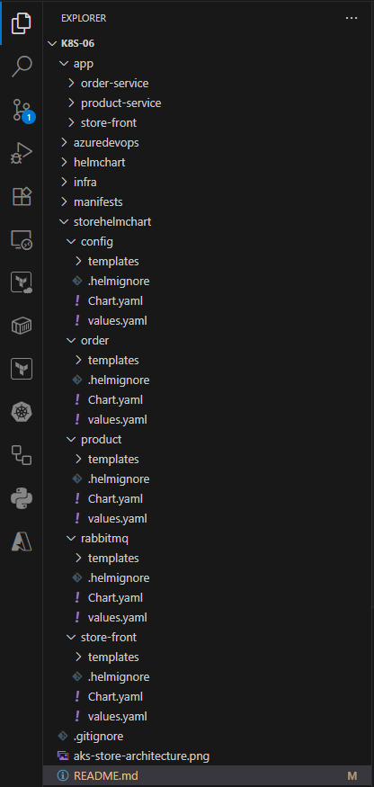

# Part 6: Deploying microservice applications in AKS using Helm Chat and Azure Pipeline(Dynamically update the image tag in values.yaml)

    Part1: Manual Deployment using comand line tools (AzCLI, Docker Desktop and kubectl)  
    GitHub: https://github.com/santosh-gh/k8s-01
    YouTube: https://youtu.be/zoJ7MMPVqFY

    Part2: Automated Deployment using Azure DevOps Pipeline
    GitHub: https://github.com/santosh-gh/k8s-02
    YouTube: https://youtu.be/nnomaZVHg9I

    Part3: Automated Infra Deployment using Bicep and Azure DevOps Pipeline
    GitHub: https://github.com/santosh-gh/k8s-03
    YouTube: https://www.youtube.com/watch?v=5PAdDPHn8F8

    Part4: Deploying microservice applications in AKS using Helm Chat
    GitHub: https://github.com/santosh-gh/k8s-04
    YouTube: https://www.youtube.com/watch?v=VAiR3sNavh0

    Part5: Deploying microservice applications in AKS using Helm Chat and Azure Pipeline
    GitHub: https://github.com/santosh-gh/k8s-04
    YouTube: https://www.youtube.com/watch?v=MnWe2KGRrxg&t=883s

    Part6: Deploying microservice applications in AKS using Helm Chat and Azure Pipeline
           With dynamically update the image tag in values.yaml
    GitHub: https://github.com/santosh-gh/k8s-06
    YouTube: https://www.youtube.com/watch?v=VAiR3sNavh0

# Architesture

    # Store front: Web application for customers to view products and place orders.
    # Product service: Shows product information.
    # Order service: Places orders.
    # RabbitMQ: Message queue for an order queue.

# Directory Structure

# Tetechnology Stack

    Azure Pipelines
    Infra (AzCLI/Bicep)
    AKS
    ACR
    HelmChart
    Helmify

# Steps

    1. Infra deployment using AzCLI/Bicep command line or 
       Pipelines azcli-infra-pipeline.yml/bicep-infra-pipeline.yml

    2. Build and push images to ACR: CI Pipelines
       order-pipeline.yml, product-pipeline.yml, store-front-pipeline.yml

    3. Helm install and Helmfy
       https://helm.sh/docs/intro/install/

       https://github.com/arttor/helmify/releases

       Advantages of helm over kubectl

       Helm uses templates with variables, so no need to duplicate YAML files for each environment

       Helm supports versioned releases and can be roll back to a previous release easily

       helm list
       helm rollback online-store 1

       Parameterization per Environment using enverionment  specific values.yaml
       helm install online-store ./helmchart -f dev-values-.yaml
       helm install online-store ./helmchart -f test-values.yaml

       Helm keeps track of installed releases, values, and history
       helm list
       helm get all online-store

    4. App deployment: CD Pipelines
       app-deploy-pipeline.yml

    5. Validate and Access the application

    6. Clean the Azure resources
    
# Infra deployment

    # Login to Azure

        az login
        az account set --subscription=<subscriptionId>
        az account show

    # Show existing resources

        az resource list

    # Create RG, ACR and AKS

        # AzCLI
        ./infra/azcli/script.sh

        OR

        # Bicep
        az deployment sub create --location uksouth --template-file ./infra/bicep/main.bicep --parameters ./infra/bicep/main.bicepparam

    # Connect to cluster

        RESOURCE_GROUP="rg-onlinestore-dev-uksouth-001"
        AKS_NAME="aks-onlinestore-dev-uksouth-001"
        az aks get-credentials --resource-group $RESOURCE_GROUP --name $AKS_NAME --overwrite-existing

        alias k=kubectl

    # Short name for kubectl

    # Show all existing objects

        k get all   

# Helm and Helmify

    # helmify

    helmify -f ./manifests/order ./storehelmchart/order

    helmify -f ./manifests/product ./storehelmchart/product

    helmify -f ./manifests/store-front ./storehelmchart/store-front

    helmify -f ./manifests/rabbitmq ./storehelmchart/rabbitmq

    helmify -f ./manifests/config ./storehelmchart/config

    # Helm Deploy

    helm install order ./helmchart/order
    helm install product ./helmchart/product
    helm install store-front./helmchart/store-front
    helm install rabbitmq ./helmchart/rabbitmq
    helm install config ./helmchart/config

    # Delete Services using helm        
     
    helm uninstall order
    helm uninstall product
    helm uninstall store-front
    helm uninstall rabbitmq
    helm uninstall config

# Verify the Deployment

    k get pods
    k get services
    curl <LoadBalancer public IP>:80
    Browse the app using http://<LoadBalancer public IP>:80

# Clean the Azure resources

# helmify  
   

    az group delete --name rg-onlinestore-dev-uksouth-001 --yes --no-wait

